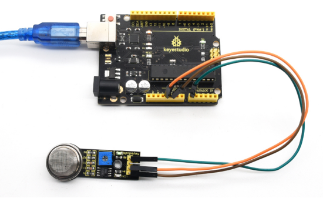

# KS0040 keyestudio Analog Gas Sensor


## 1. Introduction

This analog gas sensor - MQ2 is used in gas leakage detecting equipment in consumer electronics and industrial markets.

This sensor is suitable for detecting LPG, I-butane, propane, methane, alcohol, Hydrogen and smoke. It has high sensitivity and quick response.

In addition, the sensitivity can be adjusted by rotating the potentiometer. 

## 2. Specification

- Power Supply: 5V
- Interface Type: Analog
- Wide detecting scope
- Quick response and High sensitivity
- Simple drive circuit
- Stable and long lifespan

## 3. Connection Diagram


## 4. Sample Code

Download Code:  [Code](./Code.7z)

```
void setup()
{
	Serial.begin(9600); //Set serial baud rate to 9600 bps
}

void loop()
{
    int val;
    val=analogRead(0);//Read Gas value from analog 0
    Serial.println(val,DEC);//Print the value to serial port
    delay(100);
}
```

## 5. Result



Done wiring and powered up, upload well the code, then open the serial monitor and set the baud rate as 9600, you will see the analog value. When detecting the gas, the value will make a change.

